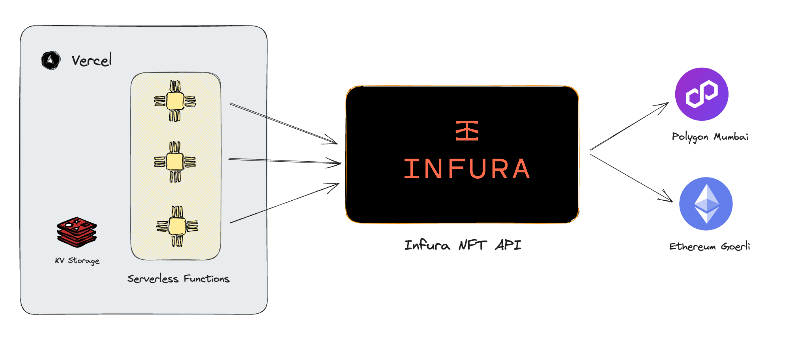

# NFT Faucet

TODO:
<br>

This app is a simple NFT Faucet tool.
It allows you to deploy and mint NFTs.
Additionally, you can view a list of transaction logs related to the NFTs.
It is very useful when developing dapps using NFTs.

## Demonstrations

### Live Demo

https://nft-faucet-ten.vercel.app/

### Demo Video

TODO:

## Architecture

<br>

### Used Technologies

* Infura NFT API
* Vercel
* Nextjs


## Development

### Requirements

* node　18.x
* pnpm 8.x

### Setup

#### Installation
```bash
# duplicate the .env.sample file and edit the .env file.
$cp .env.sample .env

# install dependencies
$pnpm install
```

#### Creating Vercel KV

* You need to create a Vercel KV (Key-Value) and copy the environment variables related to the KV into your `.env` file.
* ref. [Vercel KV Quickstart](https://vercel.com/docs/storage/vercel-kv/quickstart#quickstart)


### Run

```bash
# run dev server
$pnpm run dev

$open http://localhost:3000
```

## Useful Links

* [Infura NFT API](https://docs.infura.io/infura/infura-expansion-apis/nft-api)
* [Vercel](https://vercel.com/docs)
* [Nextjs](https://nextjs.org/docs)

## License

This app is open-source and licensed under the MIT license. For more details, check the [License file](LICENSE).
